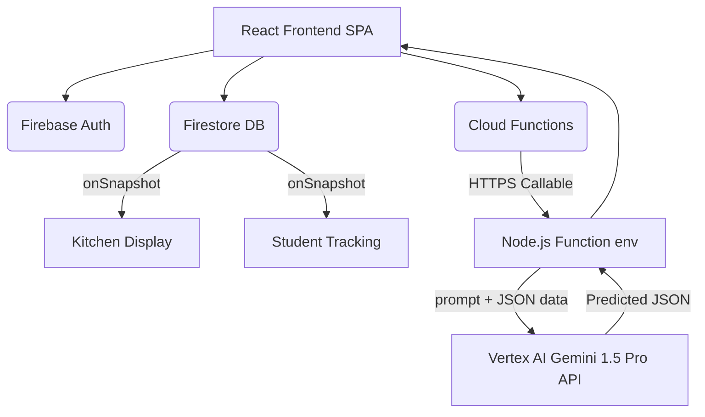

# Campus Canteen Ordering System — Documentation

## 1. Project Abstract
The Campus Canteen Ordering System is a full-stack, cloud-native web application designed to solve the critical inefficiencies inherent in physical college canteens. By transitioning from a traditional cash-and-queue model to a digital, real-time platform, the system dramatically reduces wait times and improves the food discovery experience for students. Furthermore, it empowers canteen administrators with actionable data through role-specific dashboards, automated revenue analytics, and real-time kitchen displays. The hallmark of the project is its integration with Vertex AI Gemini, which analyzes historical 30-day order patterns to provide precise, AI-driven daily preparation forecasts, directly addressing the widespread issues of food waste and component understocking. Built on React and Firebase, the architecture ensures high availability, real-time synchronization, and a premium user experience.

## 2. Problem Statement
1. **Long Queues**: Students waste significant portions of their breaks standing in line to order and pay, often resulting in late arrivals to class.
2. **Inventory Inefficiency (Food Waste / Stockouts)**: Canteen staff have zero visibility into daily demand fluctuations. They guess preparation quantities, leading to massive food waste (over-preparation) or lost revenue and angry students (under-preparation).
3. **Absence of Feedback Loop**: There is no structured way for students to rate the quality of meals or provide feedback, leading to stagnant menus and unaddressed quality issues.

## 3. Proposed Solution
1. **Queue Elimination**: A digital menu and cart system allows students to place orders from classrooms. The live Kitchen Display system eliminates paper tickets.
2. **AI-Driven Forecasting**: A serverless function connects to Vertex AI Gemini. By passing 30 days of historical data and day-of-week patterns, the LLM outputs exact suggested prep quantities for the next morning.
3. **Digital Feedback System**: After an order status updates to "Delivered," students are prompted to leave a 1-5 star rating and comment, visible instantly on the Admin dashboard.

## 4. System Architecture

## 5. Tech Stack
* **Frontend**: React 18, TypeScript, Tailwind CSS. *Why?* React Context handles fast local state (cart). Tailwind allows rapid styling of a premium dark-mode interface without heavy UI library overhead. TypeScript catches runtime errors during compilation.
* **Backend & DB**: Firebase (Firestore, Auth, Functions, Hosting). *Why?* Firestore's `onSnapshot` is the perfect solution for live Kitchen syncing without building a custom WebSocket server.
* **AI Integration**: Google Cloud Vertex AI (Gemini 1.5 Pro). *Why?* Context window allows passing entire database extracts (30 days) in a single prompt for zero-shot reasoning.

## 6. Database Design (Firestore - NoSQL)
We chose NoSQL for rapid schema iteration and real-time socket support.

1. `users`: keyed by `uid`.
   - Fields: `name` (string), `email` (string), `role` (student | canteen_staff | canteen_admin), `createdAt` (timestamp).
   - Purpose: Maps Auth user to application role.
2. `menuItems`: keyed by auto-id.
   - Fields: `name` (string), `category` (string), `price` (number), `photoUrl` (string), `available` (boolean).
   - Purpose: Master inventory.
3. `orders`: keyed by auto-id.
   - Fields: `studentId` (string), `studentName` (string), `items` (array of objects {itemId, name, price, qty}), `totalAmount` (number), `status` (string enum: Placed, Preparing, Ready, Delivered).
   - Purpose: core transactional record.
4. `feedback`: keyed by auto-id.
   - Fields: `orderId` (string), `studentId` (string), `studentName` (string), `rating` (number), `comment` (string).
   - Purpose: QoS tracking.

## 7. Module Description
1. **Digital Menu**: Staff manage items (CRUD). Students browse with category filters and "add to cart."
2. **Student Ordering**: Cart context aggregates items and computes totals. Push to Firestore only on final checkout. Payment logic is "Cash at Counter."
3. **Kitchen Display**: 3-column Kanban board for Staff. Reads `orders` where status != Delivered. Updates status on click.
4. **Live Order Status**: Student dashboard listens to their specific `orders` query.
5. **Order History**: Pulls past orders. Contains specific "Reorder" button logic that bypasses item selection and dumps items directly into Context.
6. **AI Predictor**: An isolated module for admins calling Cloud Function.
7. **Feedback & Reports**: Aggregates Firestore data using Recharts for daily visual volume.

## 8. AI Feature Explanation
The core logic resides in `functions/src/index.ts`. When a staff member clicks "Generate Forecast", the HTTPS callable function triggers. It queries Firestore for all orders `> today - 30 days`. It iterates through the documents, aggregating `quantity` per `item.name` and categorizing by `dayName` (e.g., "Mon-Samosa: 45"). This string map is injected into a prompt for `Gemini 1.5 Pro` via Vertex AI. The prompt enforces a strict JSON schema output. The Cloud Function parses the JSON string and returns it cleanly to the React frontend. **Value**: It essentially gives the canteen a Data Scientist for free.

## 9. Security Implementation
* **Authentication Flow**: Google OAuth 2.0 provides identity verification.
* **Role Verification**: Firestore rules utilize `get(/databases/$(database)/documents/users/$(request.auth.uid)).data.role` to restrict database writes.
* **Data Isolation**: A student cannot read another student's orders because `allow read: if request.auth.uid == resource.data.studentId`.
* **API Security**: Cloud Function aborts execution if `context.auth` is missing or if the decoded token does not correspond to an Admin/Staff member in Firestore.

## 10. Deployment Architecture
* **Frontend**: Firebase Hosting acts as a global CDN for the compiled static React bundle (`index.html`, `main.js`).
* **Backend**: Firestore acts as a managed DB instance in `us-central`. Cloud Functions deployed as Node.js containers scaled automatically by Google Cloud.

## 11. Future Enhancements
1. UPI/Razorpay payment gateway integration to fully eliminate cash handling.
2. FCM (Firebase Cloud Messaging) service workers for push notifications when food is `Ready`.
3. QR code generation on the student receipt to be scanned by staff at pickup.
4. Inventory tracking with ingredient-level depletion mapping based on order volume.
5. Personalised menu recommendations built on the AI pipeline.

## 12. Viva Q&A

**1. Why Firebase over a traditional backend?**
To achieve real-time Kitchen updates without building/scaling WebSockets (Socket.io) manually. Firestore's `onSnapshot` does this natively, saving weeks of development time.

**2. How does Firestore real-time work?**
It uses long-polling or WebSockets under the hood. When a client calls `onSnapshot(query)`, Firebase maintains an active socket connection and pushes document diffs to the client when the queried collection changes.

**3. How is role-based access enforced — frontend vs backend?**
Frontend uses `ProtectedRoute` to conditionally render UI elements based on the `user.role` stored in context. Backend enforces it strictly via Firestore Security Rules, preventing an attacker from executing API requests via Postman.

**4. What are Firestore Security Rules?**
They are access control logic run securely on Google's servers before an operation commits. We wrote custom functions like `getUserRole()` which reads the user's document to determine write permissions dynamically.

**5. How does the AI prediction feature work end-to-end?**
React button triggers `httpsCallable`. The Node.js Cloud Function wakes up, queries the last 30 days of Firestore orders, formats the numerical totals into a text prompt, sends it to the Vertex SDK, parses the AI's JSON reply, and returns it to React.

**6. What is Vertex AI and how does Gemini differ from other LLMs?**
Vertex AI is Google Cloud's ML/AI platform. Gemini is a multimodal model. We use it here specifically because of its massive context window (1M+ tokens), allowing us to dump raw aggregated database logs directly into the prompt without building separate Vector DBs.

**7. How did you structure the Gemini prompt?**
We injected dynamic data (historical totals + tomorrow's day of week) and explicitly demanded the output be a pure JSON array containing `itemName`, `predictedQty`, and `reasoning`.

**8. What happens if the AI returns unexpected output?**
The Cloud function has a try/catch block around `JSON.parse`. If the LLM hallucinates markdown or invalid text, parsing fails, and the Express function returns a 500 internal error which React catches and displays as a Toast error.

**9. How does the cart work without a database?**
We utilize React's `Context API` and `useState`. The cart array exists strictly in the browser's RAM. It only writes to Firestore once the user hits "Checkout."

**10. How is authentication state persisted?**
Firebase Auth persists session tokens in IndexedDB/LocalStorage. The `onAuthStateChanged` observer in `AuthContext.tsx` detects this on refresh and reconstructs the React user state automatically.

**11. What is an HTTPS Callable Cloud Function?**
It's a specialized Express endpoint hosted by Firebase that automatically decodes the Auth token from the request headers and injects it into `context.auth`, removing the need to write custom auth middleware.

**12. How did you handle real-time order updates on the student side?**
Similar to the Kitchen view, the student Dashboard listens to an `onSnapshot` query filtered for `where('studentId', '==', user.uid)`.

**13. What is the data flow when a student places an order?**
Cart Context -> `addDoc(collection('orders'))` -> Firestore -> `onSnapshot` triggers -> Kitchen UI re-renders -> Staff sees order -> Staff clicks "Prepare" -> `updateDoc(status)` -> Firestore -> `onSnapshot` triggers -> Student UI reflects "Preparing."

**14. How does the reorder feature work?**
It takes the `items` array from a completed `Order` nested object, clears the current Cart context, and loops through the array calling `addToCart` before redirecting the User to the Menu.

**15. What are the limitations of this system at scale?**
At extremely high scale (10,000+ orders/min), Firestore's 1 write/sec per document limit isn't an issue since orders are new documents, but updating a global counter or massive simultaneous AI invocations could hit quota constraints.

**16. How would you add a payment gateway?**
Integrate Razorpay SDK on the frontend to generate a token, send it to a backend Cloud Function, verify the payment signature against the Razorpay backend, and only then write the new Order document to Firestore.

**17. How did you handle loading and error states?**
We created global reusable Tailwind CSS classes like `.skeleton` for placeholder loading animations and used `react-hot-toast` for elegant, non-blocking error notifications.

**18. Difference between `onSnapshot` and `getDocs`?**
`getDocs` fetches data once as a snapshot in time. `onSnapshot` fetches data once, then leaves a socket open to continuously receive live updates.

**19. How did you prevent students seeing other orders?**
Security rules: `allow read: if resource.data.studentId == request.auth.uid`. If a student attempts to query the whole collection, Firebase immediately rejects it.

**20. What is Firebase Hosting?**
It's production-grade web content hosting that serves static assets (HTML/CSS/JS) via a global CDN with free SSL certificates automatically provisioned.

**21. How does React Context work here?**
It prevents prop-drilling. By wrapping `<App>` in `<CartProvider>`, any component nested inside can call `useCart()` to access or modify the cart array without passing props down 5 levels.

**22. What is TypeScript and why use it?**
It's a strict syntactical superset of JavaScript. We defined interfaces like `Order` and `MenuItem`, ensuring no component tries to access `order.price` when the field is actually named `order.totalAmount`.

**23. How are Recharts used?**
We process the raw Firestore order array in memory to build aggregated `dailyData` and `pieData` objects, which are passed to `<BarChart>` and `<PieChart>` declarative components.

**24. What would you change with 3 more months?**
Implementing Redux/Zustand for better complex state handling, adding comprehensive Unit Tests with Jest, and building a React Native companion mobile app.

**25. How does this system reduce food waste?**
By transitioning from "guesswork" to "data-driven prediction". The Vertex AI model analyzes exactly what sold historically on specific days to tell staff precisely how many portions to prep, thus minimizing unsold items at day's end.
